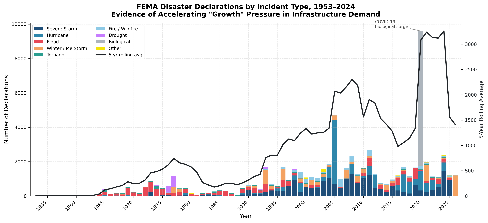
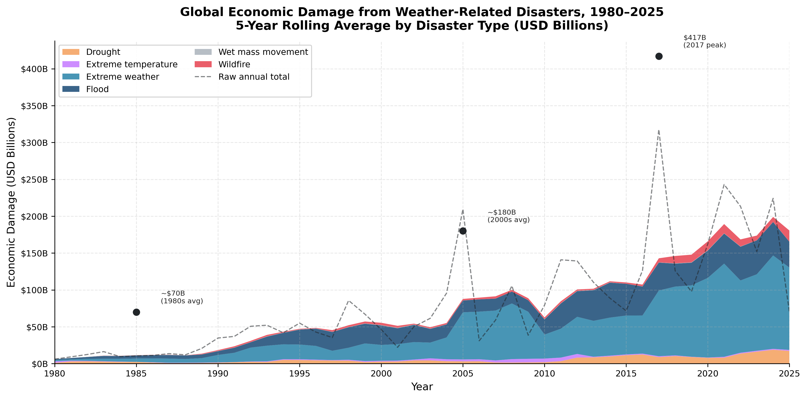
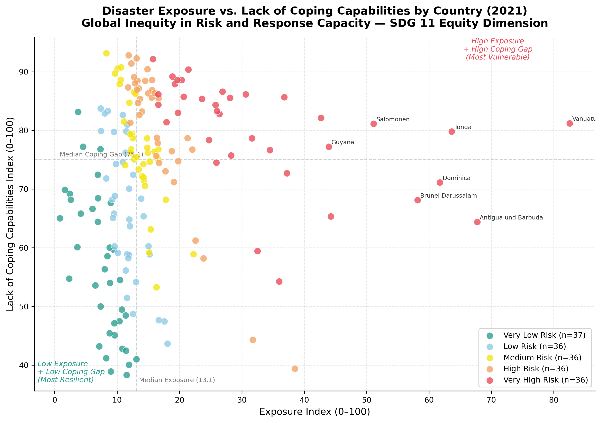

## Resilient by Design: Storm Infrastructure vs. Emergency Response

## Decision Statement
Should national policymakers invest limited resources in upgraded storm infrastructure to prevent disasters or enhanced emergency response capacity to better manage disasters when they occur, given the increasing frequency and intensity of extreme weather events and the goals of UN Sustainable Development Goal 11 (Sustainable Cities and Communities)?

## Executive Summary
Policymakers around the world face an increasingly critical strategic dilemma that will define their communities' resilience for decades: allocate scarce resources toward preventing disasters through upgraded infrastructure, or toward managing disasters through enhanced emergency response capabilities. Framed through the lens of UN SDG 11 — "Make cities and human settlements inclusive, safe, resilient and sustainable" — and the Sendai Framework for Disaster Risk Reduction 2015–2030, this decision carries profound implications for public safety, economic stability, and equitable urban development as extreme weather events transform from exceptional occurrences into routine threats.

The financial stakes are staggering and accelerating at a global scale. Global economic losses from natural catastrophes reached an estimated $417 billion in 2024, a 15% increase above the decade average, with insured losses hitting a record $154 billion. For the first time in history, 21 separate incidents in a single year resulted in multi-billion-dollar insurance claims. The UNDRR's Global Assessment Report 2025 documents that total disaster costs now exceed $2.3 trillion annually when cascading and ecosystem costs are included — a figure that has grown from $70–80 billion per year (1970–2000) to $180–200 billion (2001–2020) in direct costs alone. This acceleration leaves nations with less time and fewer resources to recover between events, forcing policymakers to make impossible choices about where to invest limited budgets.

The economic case for prevention appears compelling: research consistently demonstrates that $1 invested in pre-disaster hazard mitigation avoids at least $6 in disaster response and rebuilding costs. However, the case for enhanced emergency response is equally compelling and addresses different but critical vulnerabilities. No infrastructure can be hardened against all possible scenarios, especially as climate change introduces unprecedented nonstationary conditions. When infrastructure fails, effective emergency response saves lives and accelerates recovery. The Sendai Framework explicitly recognizes both imperatives — Priority 3 calls for investing in disaster risk reduction for resilience, while Priority 4 calls for enhancing disaster preparedness for effective response.

The decision is particularly difficult because disasters affect nations inequitably. In 2023, North America suffered the largest absolute losses ($69.57 billion), but this represented only 0.23% of GDP, while Micronesia's $4.3 billion in losses represented 46.1% of subregional GDP. The insurance protection gap stood at $263 billion in 2024 — 63% of total losses left uninsured — with coverage remaining below 1% in countries like Bangladesh, India, and Nigeria. SDG 11's explicit focus on protecting "the poor and people in vulnerable situations" creates a tension between economic efficiency (invest where assets are most valuable) and social equity (protect those most vulnerable to harm).

The governance architecture has expanded significantly: the number of countries with national disaster risk reduction strategies grew from 57 in 2015 to 131 by October 2024 under the Sendai Framework. But implementation lags far behind policy adoption. As of March 2024, only 64% of Small Island Developing States and 60% of Least Developed Countries had national DRR strategies, and even among those that do, a significant portion of disaster-related funding remains focused on response rather than prevention. With the Sendai Framework approaching its 2030 expiration and over 1.2 billion additional people expected to live in cities by 2050, the choices made now will shape whether growing urban populations face compounding disaster risk or improving resilience.

---

## Milestone 2: Data Exploration & System Mapping

### Data Sources

Four datasets were used for the exploratory data analysis. Full source documentation is available in [data/README.md](data/README.md), and the data preparation process is documented in [Wrangling.md](Wrangling.md).

1. **FEMA Disaster Declarations Summaries** — All federally declared disasters in the U.S. from 1953 to 2024 (OpenFEMA)
2. **Global Economic Damage from Natural Disasters** — Economic damage by disaster type by year, 1900–present (Our World in Data / EM-DAT)
3. **FEMA Hazard Mitigation Assistance Projects** — Project-level data on federal mitigation grants (OpenFEMA)
4. **World Risk Index** — Country-level disaster risk, exposure, and vulnerability scores, 2011–2021 (World Risk Report)

### APA Citations

Federal Emergency Management Agency. (2026). *OpenFEMA dataset: Disaster declarations summaries — v2*. U.S. Department of Homeland Security. https://www.fema.gov/openfema-data-page/disaster-declarations-summaries-v2

EM-DAT, CRED / UCLouvain. (2025). *The international disasters database*. Centre for Research on the Epidemiology of Disasters. Retrieved from https://ourworldindata.org/grapher/economic-damage-from-natural-disasters

Federal Emergency Management Agency. (2026). *OpenFEMA dataset: Hazard mitigation assistance projects — v4*. U.S. Department of Homeland Security. https://www.fema.gov/openfema-data-page/hazard-mitigation-assistance-projects-v4

Bündnis Entwicklung Hilft & Ruhr University Bochum. (2021). *World Risk Index*. Retrieved from https://www.kaggle.com/datasets/tr1gg3rtrash/global-disaster-risk-index-time-series-dataset

---

### Exploratory Data Analysis

#### Figure 1: U.S. Federal Disaster Declarations by Year (1953–2024)

The number of federally declared disasters in the United States has increased dramatically over the past seven decades. From the 1950s through the 1980s, annual declarations rarely exceeded 40 per year. Since the mid-1990s, the count has regularly surpassed 60, with recent years reaching well above 100. The 5-year moving average shows a clear upward trajectory that has accelerated since approximately 2010. This trend directly illustrates the "growth" pressure in the Growth and Underinvestment archetype — disaster demand is increasing faster than the infrastructure built to withstand it. For the decision-maker, this means the status quo is unsustainable: whether the investment goes to prevention or response, the current level of either is insufficient for the volume of disasters now occurring.

#### Figure 2: Global Economic Damage from Weather-Related Disasters (1960–2024)

Global economic losses from weather-related disasters have escalated sharply, particularly since the 1990s. Floods and extreme weather events (storms, hurricanes, tornadoes) account for the largest share of damages, with individual spike years driven by catastrophic events like Hurricane Katrina (2005), the 2011 Thailand floods, and Hurricanes Harvey/Irma/Maria (2017). The upward trend in this chart supports the cost escalation documented in the GAR 2025 — direct disaster costs grew from $70–80 billion per year (1970–2000) to $180–200 billion (2001–2020). This matters for the decision because rising costs consume the budgets that could fund either infrastructure upgrades or response capacity, activating the B1 (Budget Constraint) balancing loop in the CLD. Every dollar spent on recovery is a dollar unavailable for prevention.

#### Figure 3: FEMA Hazard Mitigation Projects and Funding by Year

This chart shows the volume of FEMA hazard mitigation projects and the associated federal funding over time. Mitigation activity has grown since the program's early years, but funding levels have fluctuated significantly and have not kept pace with the accelerating disaster trend shown in Figure 1. The gap between rising disaster frequency and relatively flat or inconsistent mitigation investment is the core evidence for the "Underinvestment" half of the Growth and Underinvestment archetype. When mitigation funding spikes, it is often in response to a major disaster year — a reactive pattern consistent with the Shifting the Burden dynamic, where response drives the budget cycle rather than proactive prevention. For policymakers, this suggests that current mitigation investment levels are structurally insufficient to bend the disaster cost curve downward.

#### Figure 4: Global Disaster Exposure vs. Vulnerability (2021)

This scatter plot reveals the global inequity at the heart of the infrastructure vs. response decision. Countries in the upper-right quadrant — high exposure and high vulnerability — are disproportionately Small Island Developing States and Least Developed Countries. These nations face the greatest disaster risk but have the least capacity to invest in either infrastructure or response. Meanwhile, countries with high exposure but low vulnerability (lower-right) tend to be wealthier nations that have invested in resilience. This pattern directly supports the SDG 11 equity argument: the communities most in need of disaster protection are the least able to fund it. For the decision-maker, this means that investment strategies must explicitly address equity — otherwise, infrastructure investments will flow to where assets are most valuable, not where people are most vulnerable.

---

## Initial Causal Loop Diagram

https://github.com/bfinucane04/ns-storm.git
