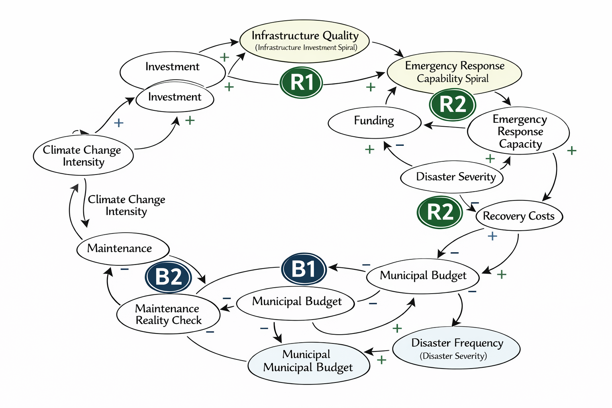

## Resilient by Design: Storm Infrastructure vs. Emergency Response

## Decision Statement
Should national policymakers invest limited resources in upgraded storm infrastructure to prevent disasters or enhanced emergency response capacity to better manage disasters when they occur, given the increasing frequency and intensity of extreme weather events and the goals of UN Sustainable Development Goal 11 (Sustainable Cities and Communities)?

## Executive Summary
Policymakers around the world face an increasingly critical strategic dilemma that will define their communities' resilience for decades: allocate scarce resources toward preventing disasters through upgraded infrastructure, or toward managing disasters through enhanced emergency response capabilities. Framed through the lens of UN SDG 11 — "Make cities and human settlements inclusive, safe, resilient and sustainable" — and the Sendai Framework for Disaster Risk Reduction 2015–2030, this decision carries profound implications for public safety, economic stability, and equitable urban development as extreme weather events transform from exceptional occurrences into routine threats.

The financial stakes are staggering and accelerating at a global scale. Global economic losses from natural catastrophes reached an estimated $417 billion in 2024, a 15% increase above the decade average, with insured losses hitting a record $154 billion. For the first time in history, 21 separate incidents in a single year resulted in multi-billion-dollar insurance claims. The UNDRR's Global Assessment Report 2025 documents that total disaster costs now exceed $2.3 trillion annually when cascading and ecosystem costs are included — a figure that has grown from $70–80 billion per year (1970–2000) to $180–200 billion (2001–2020) in direct costs alone. This acceleration leaves nations with less time and fewer resources to recover between events, forcing policymakers to make impossible choices about where to invest limited budgets.

The economic case for prevention appears compelling: research consistently demonstrates that $1 invested in pre-disaster hazard mitigation avoids at least $6 in disaster response and rebuilding costs. However, the case for enhanced emergency response is equally compelling and addresses different but critical vulnerabilities. No infrastructure can be hardened against all possible scenarios, especially as climate change introduces unprecedented nonstationary conditions. When infrastructure fails, effective emergency response saves lives and accelerates recovery. The Sendai Framework explicitly recognizes both imperatives — Priority 3 calls for investing in disaster risk reduction for resilience, while Priority 4 calls for enhancing disaster preparedness for effective response.

The decision is particularly difficult because disasters affect nations inequitably. In 2023, North America suffered the largest absolute losses ($69.57 billion), but this represented only 0.23% of GDP, while Micronesia's $4.3 billion in losses represented 46.1% of subregional GDP. The insurance protection gap stood at $263 billion in 2024 — 63% of total losses left uninsured — with coverage remaining below 1% in countries like Bangladesh, India, and Nigeria. SDG 11's explicit focus on protecting "the poor and people in vulnerable situations" creates a tension between economic efficiency (invest where assets are most valuable) and social equity (protect those most vulnerable to harm).

The governance architecture has expanded significantly: the number of countries with national disaster risk reduction strategies grew from 57 in 2015 to 131 by October 2024 under the Sendai Framework. But implementation lags far behind policy adoption. As of March 2024, only 64% of Small Island Developing States and 60% of Least Developed Countries had national DRR strategies, and even among those that do, a significant portion of disaster-related funding remains focused on response rather than prevention. With the Sendai Framework approaching its 2030 expiration and over 1.2 billion additional people expected to live in cities by 2050, the choices made now will shape whether growing urban populations face compounding disaster risk or improving resilience.

## Initial Causal Loop Diagram

---

## 📊 Milestone 2: Data Exploration & System Mapping

### 📁 Data Summary  
To further support the decision between investing in storm infrastructure or emergency response capacity, multiple datasets were analyzed focusing on disaster frequency, economic damages, infrastructure performance, and recovery outcomes. These datasets include historical records of extreme weather events, financial damage estimates, outage durations, and response effectiveness metrics.  

The data was cleaned and standardized through processes such as handling missing values, aligning date formats, aggregating time-based trends, and merging datasets for comparative analysis. This allowed for a clearer and more reliable understanding of how disaster impacts evolve over time and how different strategies influence outcomes.

---

### 📈 Visualization 1: Disaster Frequency Over Time  

**Insight:**  
This visualization shows a clear upward trend in the frequency of extreme weather events over time.  

**Why it matters:**  
As disasters become more frequent, relying solely on emergency response becomes increasingly difficult. This strengthens the case for proactive infrastructure investment to reduce long-term risk and system strain.

---

### 📊 Visualization 2: Disaster Damages Over Time  

**Insight:**  
Economic damages from disasters have increased significantly over time, indicating that events are becoming both more frequent and more severe.  

**Why it matters:**  
This reinforces the financial importance of prevention. Infrastructure investment can reduce long-term costs by minimizing damage before disasters occur.

---

### 🔗 Visualization 3: Outage Duration vs. Damage  

**Insight:**  
There is a positive relationship between outage duration and economic damage, where longer outages are associated with greater losses.  

**Why it matters:**  
This highlights the value of emergency response systems. Faster recovery reduces outage duration and limits total economic impact, demonstrating the importance of maintaining strong response capabilities.

---

### 💰 Visualization 4: Mitigation Investment vs. Cost Savings  

**Insight:**  
Higher investment in mitigation and infrastructure leads to significantly greater avoided losses.  

**Why it matters:**  
This supports the widely accepted finding that preventative investment delivers strong returns, making infrastructure upgrades a highly effective long-term strategy.

---

### 🔁 Refined Causal Loop Diagram  

The refined causal loop diagram expands on the initial model by incorporating insights from the data analysis. It illustrates how disaster frequency, infrastructure resilience, emergency response capacity, economic damage, and recovery time interact within the system.

---

### 🔄 Key Feedback Loops  

**Reinforcing Loop (R1): Infrastructure Degradation Cycle**  
Declining infrastructure quality increases disaster impact, which leads to greater economic damage. This reduces available funding for infrastructure improvements, further weakening resilience over time.

**Balancing Loop (B1): Emergency Response Stabilization**  
As disaster impact increases, emergency response efforts intensify, reducing recovery time and limiting additional damage. This helps stabilize the system even when infrastructure fails.

**Reinforcing Loop (R2): Preventative Investment Cycle**  
Increased investment in infrastructure improves resilience, which reduces disaster damage. Lower damage preserves financial resources, allowing for continued investment and strengthening long-term outcomes.

---

### 🎯 Connection to Decision  

The data analysis and system mapping demonstrate that both infrastructure investment and emergency response play essential but distinct roles. Infrastructure reduces the likelihood and severity of disaster impacts, while emergency response mitigates damage after events occur.  

However, the increasing frequency and cost of disasters suggest that a reactive approach alone is not sustainable. The reinforcing benefits and strong return on investment associated with infrastructure improvements indicate that prevention should be prioritized.  

At the same time, emergency response remains necessary to manage unavoidable system failures. Therefore, the most effective strategy is to prioritize infrastructure investment while maintaining sufficient emergency response capacity to ensure overall community resilience.
