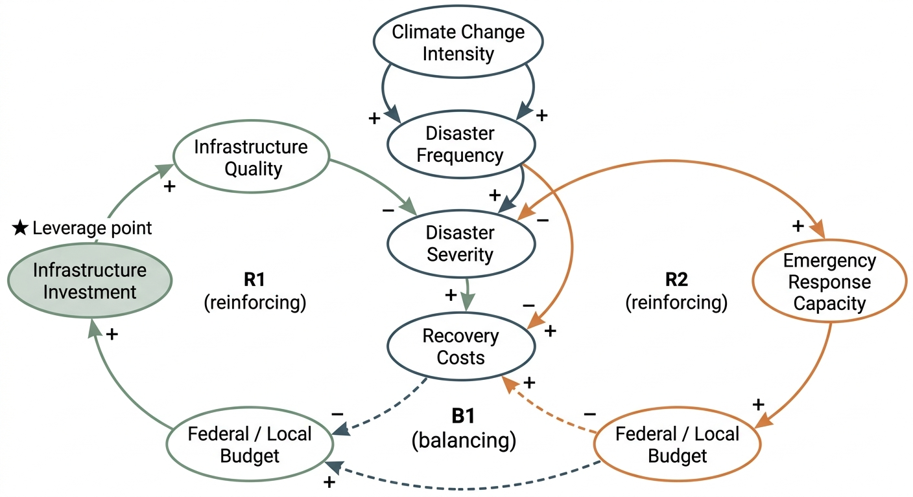

# Resilient by Design: Storm Infrastructure vs. Emergency Response

## Decision Statement

Should national policymakers invest limited resources in upgraded storm infrastructure to prevent disasters or enhanced emergency response capacity to better manage disasters when they occur, given the increasing frequency and intensity of extreme weather events and the goals of UN Sustainable Development Goal 11 (Sustainable Cities and Communities)?

---

## Executive Summary

Policymakers face a compounding strategic dilemma: as extreme weather events intensify, where should scarce resilience budgets go — preventing disasters through upgraded infrastructure, or managing them through stronger emergency response? This project analyzes that question through the lens of UN SDG 11 and the Sendai Framework for Disaster Risk Reduction, drawing on four datasets spanning 70 years of U.S. disaster declarations, global economic damage records, federal mitigation spending, and the World Risk Index.

The evidence consistently favors prevention. Global disaster losses have grown from roughly $70 billion annually in the 1980s to over $150 billion today, while hazard mitigation spending has remained reactive and volatile — spiking after catastrophic events then falling back before the investments can compound. Research documents a 6:1 return on pre-disaster mitigation, yet the structural bias of political systems toward visible post-disaster response over invisible prevention keeps that return perpetually unrealized.

The equity dimension complicates the choice significantly. The nations most exposed to disaster risk — Small Island Developing States like Vanuatu, Tonga, and the Solomon Islands — are precisely those with the least fiscal capacity to fund either infrastructure or response. Any investment strategy that follows economic efficiency alone will flow resources to wealthy nations with high absolute losses, not to the populations SDG 11 is designed to protect.

The recommendation is a sustained, equity-weighted prevention-first investment strategy, conditioned on risk-informed urban planning reform and structured to survive electoral cycles — paired with maintained emergency response capacity targeted at residual and equity-priority risk.

---

## Table of Contents

1. [Background](#background)
2. [Data Sources](#data-sources)
3. [Exploratory Findings](#exploratory-findings)
4. [System Dynamics](#system-dynamics)
5. [Analysis](#analysis)
6. [Recommendations](#recommendations)
7. [Limitations and Future Work](#limitations-and-future-work)
8. [References](#references)

---

## Background

Full decision context, literature review, and policy framework summary: [Background.md](Background.md)

Key context: global disaster costs now exceed $2.3 trillion annually when cascading costs are included, up from $70–80 billion per year in 1970–2000. The Sendai Framework's 2030 deadline is approaching with implementation lagging policy adoption. Over 1.2 billion additional people will live in cities by 2050 — making urban resilience investment decisions made today consequential for decades.

---

## Data Sources

Four datasets were used. Full source documentation is in [data/README.md](data/README.md). Data preparation is documented in [Wrangling.md](Wrangling.md).

| Dataset | Source | Coverage |
|---|---|---|
| FEMA Disaster Declarations Summaries | OpenFEMA | U.S., 1953–2024 |
| Global Economic Damage from Natural Disasters | Our World in Data / EM-DAT | Global, 1900–present |
| FEMA Hazard Mitigation Assistance Projects | OpenFEMA | U.S., 1989–2024 |
| World Risk Index | Bündnis Entwicklung Hilft / Ruhr University | Global, 2011–2021 |

---

## Exploratory Findings

### Figure 1: FEMA Disaster Declarations by Incident Type (1953–2024)

Disaster declarations have more than tripled since the 1980s, driven by severe storms, hurricanes, and floods. The 5-year rolling average shows a clear upward trajectory that accelerated around 2010. The COVID-19 surge (~2020) is annotated to avoid misinterpretation — even excluding it, the weather-related trend is unmistakably upward. This is the "growth" pressure in the Growth and Underinvestment system archetype: disaster demand is increasing faster than the infrastructure built to withstand it.

### Figure 2: Global Economic Damage from Weather-Related Disasters (1980–2025)

Global economic losses from weather-related disasters have escalated sharply, with floods and extreme weather events accounting for the largest share. The 5-year rolling average now trends above $150 billion annually. Key reference points — $70B (1980s average), $180B (2000s average), $417B (2017 peak) — confirm the GAR 2025's documented acceleration. Every dollar spent on disaster recovery is a dollar unavailable for prevention.

### Figure 3: FEMA Declarations vs. Federal Hazard Mitigation Spending (1989–2024)

Disaster declarations trend steadily upward while mitigation spending swings erratically — spiking after Katrina, Sandy, and Harvey/Irma/Maria, then falling back. This reactive pattern is the core evidence for both the Growth and Underinvestment archetype and the Shifting the Burden dynamic: investment follows collapse rather than preventing it. The structural mismatch between growing disaster demand and inconsistent prevention investment is the central policy failure this project addresses.

### Figure 4: Disaster Exposure vs. Lack of Coping Capabilities by Country (2021)

Countries in the upper-right quadrant — high exposure combined with a severe lack of coping capabilities — are disproportionately Small Island Developing States: Vanuatu, Tonga, Solomon Islands, Dominica, Antigua and Barbuda. These nations face the greatest disaster risk with the least capacity to invest in either infrastructure or response. In 2023, North America suffered $69.57 billion in losses (0.23% of GDP), while Micronesia's $4.3 billion represented 46.1% of subregional GDP. SDG 11's equity mandate requires explicitly addressing this gap.

---

## System Dynamics

### Final Causal Loop Diagram

### CLD Explanation

The CLD maps four key relationships in the disaster resilience system:

**R1 — Infrastructure Investment Spiral (reinforcing):** Infrastructure investment builds infrastructure quality, which reduces disaster severity, which lowers recovery costs, which frees budget for further investment. This virtuous cycle requires sustained commitment to activate — Figure 3 shows it has never been allowed to run long enough to compound.

**R2 — Emergency Response Spiral (reinforcing):** Response investment builds emergency response capacity, which reduces the per-event cost of disasters, which lowers recovery costs, which frees budget for further response investment. This loop addresses consequences rather than causes — it does not reduce disaster frequency.

**B1 — Budget Constraint (balancing):** Recovery costs drain the federal and local budget, crowding out both infrastructure and response investment. This is the central constraint throttling both reinforcing loops, and the mechanism through which the Growth and Underinvestment archetype operates. The dashed line in the CLD highlights it as the key limiting relationship.

**Exogenous driver — Climate Change Intensity:** Climate change intensifies both disaster frequency and disaster severity independently of policy decisions, increasing the urgency of activating R1 before the B1 constraint tightens further.

The structural insight: both R1 and R2 are constrained by the same B1 mechanism. Choosing one over the other does not escape the constraint. The highest-leverage intervention — marked on the CLD — is risk-informed urban planning linked to financial incentives, which reduces the rate of new risk creation and gradually weakens B1 from the demand side.

Full systems analysis including archetype identification, three scenario narratives, and leverage point analysis: [Analysis.md](Analysis.md)

---

## Recommendations

**Bottom line: invest in prevention first, with sustained multi-year commitment and explicit equity targeting.**

The 6:1 return on pre-disaster mitigation is well-documented. Figures 2 and 3 together show the cost of the alternative: $150B+ in annual losses and a mitigation spending pattern that has never been allowed to compound. Emergency response investment is necessary but insufficient — it manages consequences of a risk level that continues to rise.

**Specific actions for policymakers:**

1. **Establish a 10-year prevention investment baseline** — set mitigation funding as a fixed percentage of GDP, insulated from post-disaster supplementals, to break the reactive spending cycle. Target: double current U.S. federal mitigation spending levels, sustained across electoral cycles through multi-year authorization.

2. **Condition disaster financing on risk-informed planning** — make updated land use regulations and hazard exposure assessments a prerequisite for federal grants and post-disaster recovery funds. This is the highest-leverage intervention available: it slows the creation of new risk rather than managing past decisions.

3. **Direct equity-weighted investment to high-vulnerability nations** — allocate at minimum 40% of multilateral resilience funding to high-exposure, low-coping-capacity countries (Figure 4 upper-right quadrant), paired with technical assistance.

4. **Maintain emergency response as a residual capacity** — sized to manage risk that infrastructure investment cannot eliminate, with particular attention to the communities in Figure 4's most vulnerable quadrant.

**Key uncertainties:** Political sustainability of prevention commitment across electoral cycles; risk that planning reform becomes exclusionary zoning rather than genuine resilience; variance in mitigation investment returns under accelerating climate change.

Full recommendations with supporting evidence: [recommendations.md](recommendations.md)

---

## Limitations and Future Work

**Data limitations:** U.S. FEMA datasets reflect one national context; generalization to other governance systems requires caution. Economic damage figures are in nominal dollars, so the upward trend overstates the real increase to some degree (though the magnitude of growth far exceeds inflation). World Risk Index data ends in 2021. FEMA mitigation spending reflects federal share obligated, not total investment including state and local match.

**Analytical limitations:** The systems analysis identifies structural patterns but does not model quantitative dynamics — the scenario narratives are qualitative. The 6:1 mitigation return is an average that masks high variance across project types and geographies. The equity analysis identifies which nations are most vulnerable but does not model how investment would need to be distributed to close the protection gap.

**Future work:** A quantitative system dynamics model (Vensim or equivalent) would allow scenario simulations with explicit feedback delays and sensitivity analysis. A cost-benefit analysis at the jurisdiction level — accounting for local hazard profiles, infrastructure age, and fiscal capacity — would sharpen the investment targeting recommendation. Longitudinal tracking of the World Risk Index post-2021 would allow assessment of whether current policy trajectories are improving or worsening global vulnerability scores.

---

## References

Federal Emergency Management Agency. (2026). *OpenFEMA dataset: Disaster declarations summaries — v2*. U.S. Department of Homeland Security. https://www.fema.gov/openfema-data-page/disaster-declarations-summaries-v2

EM-DAT, CRED / UCLouvain. (2025). *The international disasters database*. Centre for Research on the Epidemiology of Disasters. https://ourworldindata.org/grapher/economic-damage-from-natural-disasters

Federal Emergency Management Agency. (2026). *OpenFEMA dataset: Hazard mitigation assistance projects — v4*. U.S. Department of Homeland Security. https://www.fema.gov/openfema-data-page/hazard-mitigation-assistance-projects-v4

Bündnis Entwicklung Hilft & Ruhr University Bochum. (2021). *World Risk Index*. https://www.kaggle.com/datasets/tr1gg3rtrash/global-disaster-risk-index-time-series-dataset

United Nations Office for Disaster Risk Reduction. (2025). *Global Assessment Report on Disaster Risk Reduction 2025*. UNDRR.

United Nations. (2015). *Sendai Framework for Disaster Risk Reduction 2015–2030*. UNDRR.
